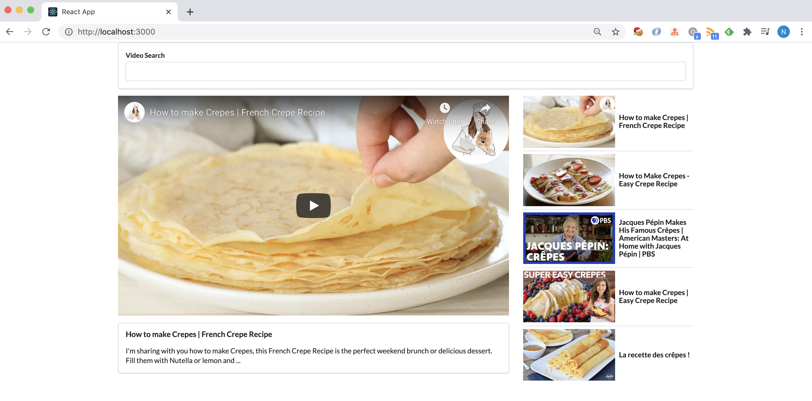

# React Video Player

A React app similar to youtube?

Tutorials from Modern React with Redux [2020 Update](https://www.udemy.com/course/react-redux/)

### Component hierarchy and Data Flow

1. The App (A) component has a list of videos.

2. A passes them down to the VideoList (VL) component.

3. A also passes a reference to a callback function (onSelectedVideo) down to VL.

4. Then, VL will take that callback and pass it down to each of the VideoItem (VI) component.

5. Anytime that the user clicks on the video item, VI is told to call that callback, to pass in the selected video item.
